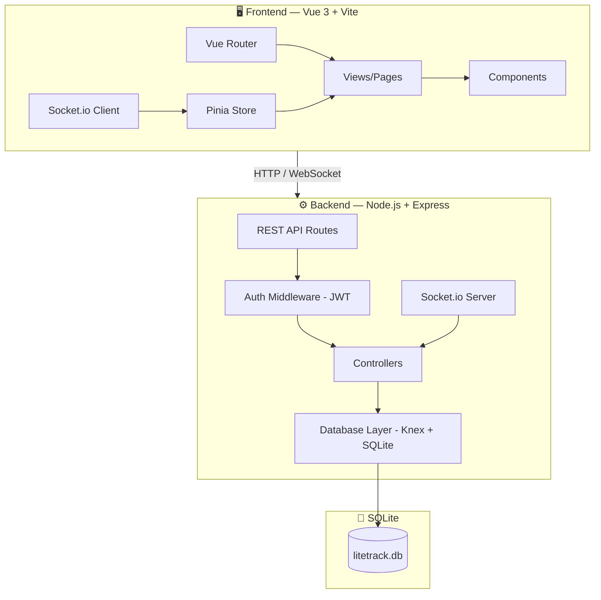
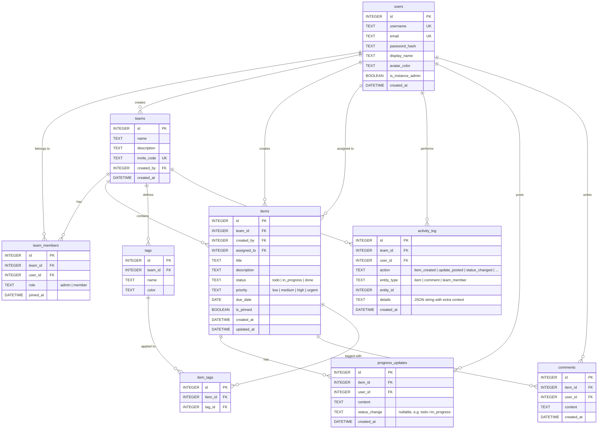

# LiteTrack — Team Collaboration Progress Tracker

A full-stack web app where team members create work items, post progress updates, and track project status in real time.

---

## 📐 Architecture Overview



### Tech Stack

| Layer | Technology | Why |
|---|---|---|
| Frontend | **Vue 3** + Vite | Simple, reactive, fast dev experience |
| State | **Pinia** | Official Vue state management, lightweight |
| Routing | **Vue Router 4** | SPA navigation |
| Styling | **Vanilla CSS** | Full control, modern design system |
| Backend | **Node.js + Express** | Simple, widely supported |
| Real-time | **Socket.io** | Reliable WebSocket with fallback |
| Database | **SQLite** via Knex client | Local file-based, zero config, fast for small single-instance teams |
| Auth | **JWT** + `bcryptjs` | Stateless, secure |
| DB Access | **Knex.js** | Single database access layer for migrations, queries, and transactions |

### V1 Scope Assumptions

- The application is team-scoped: every item, tag, activity entry, comment, and progress update must belong to a team directly or through an item.
- Team members can collaborate on items in real time. Guests, public sharing, and cross-team visibility are out of scope for V1.
- The application also has an instance-level administrator role for tenant management. Instance admins can see every team in the deployment, inspect each team's members, change team member roles, remove members, and create items in any team. This is separate from per-team `admin` / `member` membership roles.
- Dashboard supports both Kanban and list views in V1.
- Progress updates and comments are text-only in V1; file attachments are deferred.
- @mentions, notification delivery, subtasks, recurring tasks, and custom workflow columns are deferred.
- SQLite is acceptable for the expected small-team public deployment as long as the backend runs as a single instance with a persistent disk/volume.
- V1 uses hard deletes for items/tags where allowed, while `activity_log.details` keeps enough denormalized context to explain what happened later.
- The first creator of a team becomes `admin`; users who join through an invite code become `member` by default.

### Implementation Guardrails

These rules are part of the specification, not suggestions:

- Implement only the features, endpoints, tables, components, and workflows explicitly listed in this document.
- Do not add "nice to have" features during implementation, even if they seem useful or conventional.
- If a desired behavior is not in this document, treat it as out of scope until the plan is updated.
- If requirements are ambiguous, choose the simplest implementation that satisfies the documented behavior.
- Any new dependency, external service, database table, API endpoint, background job, or user-facing workflow must be justified by an existing section of this plan.
- Bug fixes and security fixes are allowed, but they should not expand product scope.
- Keep V1 behavior predictable over clever: no hidden automation, no implicit workflow changes, no generated content, and no surprise notifications.
- Update this plan before implementing any scope change.

### Explicit V1 Non-Goals

- File uploads, attachments, image previews, or document storage.
- @mentions, notifications, email delivery, web push, or reminder systems.
- OAuth/SSO, password reset emails, email verification, billing, public sharing, or guest access.
- Custom workflow columns, custom roles, subtasks, recurring tasks, dependencies, or estimates.
- Drag-and-drop Kanban interactions; status changes use explicit controls in V1.
- Rich text/Markdown rendering, reactions, emoji reactions, or comment editing history.
- Analytics dashboards, reports, burndown charts, exports, or admin panels beyond team settings.
- Multi-instance backend deployment while SQLite is the database.

---

## 💾 Database Schema



### Data Integrity Rules

Add these constraints in migrations, not only in application code:

| Table | Constraint / Behavior |
|---|---|
| `users` | `username` and `email` unique, preferably case-insensitive (`COLLATE NOCASE` in SQLite). |
| `users` | `is_instance_admin` uses a DB-level `CHECK` constraint and defaults to `0`; the seeded `admin` account is an instance admin. |
| `teams` | `invite_code` unique; `created_by` references `users.id`; do not allow deleting a creator user while teams still reference them. |
| `team_members` | `UNIQUE(team_id, user_id)`; `team_id` cascades on team delete; `role CHECK(role IN ('admin', 'member'))`. |
| `items` | `team_id` cascades on team delete; `created_by` references `users.id`; `assigned_to` references `users.id` and should be nullable with `ON DELETE SET NULL` if user deletion is later supported; `status`, `priority`, and `is_pinned` use DB-level `CHECK` constraints. |
| `tags` | `UNIQUE(team_id, name)`; `team_id` cascades on team delete. |
| `item_tags` | `UNIQUE(item_id, tag_id)`; cascade when item or tag is deleted. |
| `progress_updates` | cascade when item is deleted; `user_id` references `users.id`. |
| `comments` | cascade when item is deleted; `user_id` references `users.id`. |
| `activity_log` | cascade when team is deleted; keep `details` as JSON text with item title/user display name snapshots. |

DB-level checks:

- `team_members.role IN ('admin', 'member')`
- `users.is_instance_admin IN (0, 1)`
- `items.status IN ('todo', 'in_progress', 'done')`
- `items.priority IN ('low', 'medium', 'high', 'urgent')`
- `items.is_pinned IN (0, 1)`

Application-level consistency checks that foreign keys cannot fully enforce:

- `items.assigned_to` must be a member of the same item team when set.
- `item_tags.tag_id` must reference a tag from the same team as the item.
- Comments and progress updates can only be created by current team members.
- Item/detail reads must verify current-user membership through the item's team.

Recommended indexes:

| Index | Why |
|---|---|
| `team_members(team_id, user_id)` | Membership checks and duplicate prevention. |
| `team_members(user_id)` | Listing teams for the current user. |
| `items(team_id, status)` | Dashboard columns and filters. |
| `items(team_id, assigned_to)` | "My Items" and assignee filters. |
| `items(team_id, due_date)` | Due/overdue sorting. |
| `items(team_id, is_pinned, updated_at)` | Pinned-first dashboard ordering. |
| `tags(team_id, name)` | Team tag lookup. |
| `progress_updates(item_id, created_at)` | Item timeline. |
| `comments(item_id, created_at)` | Item discussion thread. |
| `activity_log(team_id, created_at)` | Activity feed. |

Schema fields to consider before implementation:

- Add `updated_at` to `teams`, `tags`, `comments`, and `progress_updates` if edit support is planned.
- Add `completed_at` to `items` if completion reporting or cycle-time metrics matter.
- Add `deleted_at` later only if audit-friendly soft deletes become a requirement.
- Store all timestamps in UTC ISO strings or SQLite datetime values consistently.

### Database Access Policy

- Use Knex as the only application database access layer for migrations, queries, and transactions.
- Do not mix direct `better-sqlite3.prepare()` calls into controllers/services; this keeps transaction handling and query style consistent.
- Database writes that create activity logs and socket broadcasts should use one Knex transaction for the domain write plus `activity_log` insert.
- Socket broadcasts happen after the transaction commits, not inside the transaction.
- Keep SQL portable where practical so a future PostgreSQL migration remains realistic.

### SQLite Deployment Policy

- V1 deployment is single backend instance only. Do not run multiple API containers/processes writing to the same SQLite file.
- Store the database file on persistent storage, not ephemeral container filesystem.
- Enable these startup settings on every connection:
  - `PRAGMA foreign_keys = ON`
  - `PRAGMA journal_mode = WAL`
  - `PRAGMA busy_timeout = 5000`
- Add automatic daily backups and pre-migration backups before any schema change in production.
- Keep a path open for PostgreSQL later if usage grows beyond small-team/single-instance constraints.

---

## 🔌 API Design

### Auth
| Method | Endpoint | Description |
|---|---|---|
| POST | `/api/auth/register` | Create new user account |
| POST | `/api/auth/login` | Login, returns JWT |
| GET | `/api/auth/me` | Get current user profile |

### Teams
| Method | Endpoint | Description |
|---|---|---|
| POST | `/api/teams` | Create a new team |
| GET | `/api/teams` | List user's teams |
| POST | `/api/teams/join` | Join team via invite code |
| GET | `/api/teams/:id/members` | List team members |
| PUT | `/api/teams/:id` | Update team info (admin) |

### Instance Admin
| Method | Endpoint | Description |
|---|---|---|
| GET | `/api/admin/overview` | Instance admin overview of all teams, users, memberships, and role assignments |

### Items
| Method | Endpoint | Description |
|---|---|---|
| POST | `/api/teams/:teamId/items` | Create a new item |
| GET | `/api/teams/:teamId/items` | List items (with filters: status, assignee, tag, search) |
| GET | `/api/items/:id` | Get item detail + updates + comments |
| PUT | `/api/items/:id` | Update item (title, status, priority, assignee, due date, pin) |
| DELETE | `/api/items/:id` | Delete item (admin/creator) |

### Progress Updates
| Method | Endpoint | Description |
|---|---|---|
| POST | `/api/items/:itemId/updates` | Post a progress update |
| GET | `/api/items/:itemId/updates` | List all updates for an item |

### Comments
| Method | Endpoint | Description |
|---|---|---|
| POST | `/api/items/:itemId/comments` | Add a comment |
| GET | `/api/items/:itemId/comments` | List comments |

### Tags
| Method | Endpoint | Description |
|---|---|---|
| POST | `/api/teams/:teamId/tags` | Create a tag |
| GET | `/api/teams/:teamId/tags` | List team tags |

### Activity Log
| Method | Endpoint | Description |
|---|---|---|
| GET | `/api/teams/:teamId/activity` | Get recent activity feed |

### Additional V1 Endpoints To Add

| Method | Endpoint | Description |
|---|---|---|
| PATCH | `/api/teams/:id/members/:userId` | Change member role (admin only) |
| DELETE | `/api/teams/:id/members/:userId` | Remove member or leave team |
| POST | `/api/teams/:id/invite-code/regenerate` | Regenerate invite code (admin only) |
| PUT | `/api/tags/:id` | Rename/recolor a tag (admin only) |
| DELETE | `/api/tags/:id` | Delete a tag and item tag links |

### API Contract Standards

- All protected routes require `Authorization: Bearer <jwt>`.
- Success responses use a consistent envelope: `{ "data": ... }`.
- List responses use `{ "data": [...], "page": { "limit": 50, "offset": 0, "total": 123 } }` when pagination is needed.
- Error responses use `{ "error": { "code": "VALIDATION_ERROR", "message": "...", "details": ... } }`.
- Use standard status codes: `400` validation, `401` unauthenticated, `403` forbidden, `404` not found or not visible, `409` conflict/duplicate, `429` rate limited.
- Validate request bodies with a schema library such as `zod`, `joi`, or `express-validator`.
- Do not trust `teamId`, `itemId`, or `userId` from the client until membership and authorization checks pass.

Suggested validation limits:

| Field | Rule |
|---|---|
| `username` | 3-32 chars, letters/numbers/underscore/hyphen. |
| `email` | Valid email, normalized to lowercase for uniqueness. |
| `password` | Minimum 8 chars for V1. |
| `team.name` | 1-80 chars. |
| `item.title` | 1-140 chars. |
| `item.description` | 0-5000 chars. |
| `item.status` | `todo`, `in_progress`, `done`. |
| `item.priority` | `low`, `medium`, `high`, `urgent`. |
| `comment.content` / `progress_update.content` | 1-5000 chars, plain text rendered safely. |
| `tag.name` | 1-32 chars, unique inside team. |
| `tag.color` | Hex color string or a controlled palette token. |

### Authorization Matrix

Default V1 policy:

Actor columns are additive. For example, a normal member who created an item gets the `Creator` permissions for that item.

| Action | Admin | Member | Creator | Assignee |
|---|---:|---:|---:|---:|
| View team data | Yes | Yes | Yes | Yes |
| Update team settings | Yes | No | No | No |
| Regenerate invite code | Yes | No | No | No |
| Manage members/roles | Yes | No | No | No |
| Create item | Yes | Yes | Yes | Yes |
| Edit any item metadata | Yes | No | No | No |
| Edit own created item | Yes | No | Yes | No |
| Change assigned item status | Yes | No | Yes | Yes |
| Delete any item | Yes | No | No | No |
| Delete own created item | Yes | No | Yes | No |
| Create comments/updates | Yes | Yes | Yes | Yes |
| Manage tags | Yes | No | No | No |
| View activity feed | Yes | Yes | Yes | Yes |

Notes:

- Users must be team members before accessing any team-scoped resource.
- Returning `404` instead of `403` for resources outside the user's teams avoids leaking existence.
- A team must always have at least one admin. Block removing/demoting the last admin.
- If a member is removed from a team, decide whether their historical comments/updates remain visible. Recommended V1 behavior: keep history visible and block future access.

### Auth & Security

- Use `bcryptjs` with configurable rounds; recommended default is 12.
- JWT payload should include only stable identifiers such as `sub`/`userId`; load roles from the database per team.
- Recommended V1 token expiry: 7 days for local/team use. Shorten this if deployed on the public internet.
- V1 decision for public deployment: store JWT in a secure httpOnly SameSite cookie so frontend JavaScript cannot read the token directly. Add CSRF protection for state-changing requests.
- Add basic rate limiting for `/api/auth/login`, `/api/auth/register`, and invite-code joins.
- Configure CORS with an explicit `CLIENT_ORIGIN`, not `*`, when credentials or auth headers are used.
- Escape/sanitize all user-generated text on render. Treat comments and progress updates as plain text, not HTML.
- Keep `JWT_SECRET`, database path, and client origin in `.env`.

### WebSocket Events (Socket.io)

| Event | Direction | Payload | Description |
|---|---|---|---|
| `join_team` | Client → Server | `{ teamId }` | Subscribe to team updates |
| `item_created` | Server → Client | `{ item }` | New item broadcast |
| `item_updated` | Server → Client | `{ item }` | Item status/detail changed |
| `update_posted` | Server → Client | `{ update, itemId }` | New progress update |
| `comment_posted` | Server → Client | `{ comment, itemId }` | New comment |
| `activity` | Server → Client | `{ activity }` | Activity log entry |

Additional events recommended for consistency:

| Event | Direction | Payload | Description |
|---|---|---|---|
| `item_deleted` | Server -> Client | `{ itemId, teamId }` | Remove deleted item from open views |
| `tag_created` | Server -> Client | `{ tag }` | New team tag |
| `tag_updated` | Server -> Client | `{ tag }` | Tag renamed/recolored |
| `tag_deleted` | Server -> Client | `{ tagId, teamId }` | Remove tag from filters/cards |
| `member_joined` | Server -> Client | `{ member }` | Team member list changed |
| `member_removed` | Server -> Client | `{ userId, teamId }` | Team member removed |
| `team_updated` | Server -> Client | `{ team }` | Team name/description/invite state changed |

### Realtime Semantics

- Authenticate the Socket.io connection with the same JWT used by REST requests.
- `join_team` must verify membership before joining a `team:<teamId>` room.
- Server emits events only after the database write and activity log write succeed.
- Client should upsert by ID when receiving socket payloads, so events are idempotent.
- On reconnect, client should refetch the active team dashboard, item detail, and recent activity instead of relying on missed events.
- REST remains the source of truth. Socket events are delivery hints for refreshing local state.
- Use `updated_at` as a lightweight conflict signal. If a client updates stale data, return `409 CONFLICT` or last-write-wins explicitly.

---

## 🖥️ Frontend Pages & Components

### Pages (Views)

| Page | Route | Description |
|---|---|---|
| **Login / Register** | `/login`, `/register` | Auth forms with smooth transitions |
| **Team Selector** | `/teams` | List teams, create/join team |
| **Dashboard** | `/team/:id` | Main view — items by status (Kanban or list), filters, search |
| **Item Detail** | `/team/:id/item/:itemId` | Full item view with progress timeline, comments, metadata |
| **My Items** | `/team/:id/my-items` | Personal filtered view |
| **Activity Feed** | `/team/:id/activity` | Global team activity stream |
| **Team Settings** | `/team/:id/settings` | Manage members, invite code, team info |
| **Admin Console** | `/admin` | Instance-level team/member overview for instance admins |

### Key Components

| Component | Description |
|---|---|
| `AppHeader` | Top nav with team name, user avatar, navigation |
| `ItemCard` | Compact card showing title, status badge, assignee, priority, tags |
| `ItemBoard` | Kanban-style board with columns by status |
| `ItemList` | List view alternative to Kanban |
| `ItemDetailPanel` | Full item view with tabs for Updates / Comments |
| `ProgressTimeline` | Chronological feed of progress updates with user avatars |
| `CommentSection` | Discussion thread on an item |
| `StatusBadge` | Colored pill showing item status |
| `PriorityIndicator` | Visual priority indicator |
| `TagChip` | Colored tag pill |
| `UserAvatar` | Circle with initials + unique color |
| `FilterBar` | Status / assignee / tag / search filters |
| `ActivityFeed` | Live-updating activity stream |
| `CreateItemModal` | Modal form to create new item |
| `InviteCodeDisplay` | Shows copyable team invite code |

### Frontend State & UX Rules

- Route guards redirect unauthenticated users to `/login` and authenticated users without a selected team to `/teams`.
- Stores should normalize entities by ID where practical (`itemsById`, `membersById`, `tagsById`) and keep active view IDs separately.
- Every data view needs loading, empty, error, and retry states.
- Show a reconnecting/offline indicator when Socket.io disconnects; continue to allow read-only interaction with cached state.
- Prefer pessimistic writes for create/delete and simple optimistic updates for status changes only if rollback is implemented.
- Avoid duplicate UI updates by reconciling the REST response and later socket event through ID-based upsert.
- Forms should show field-level validation errors returned by the API.
- Dashboard filters should be reflected in URL query params so refresh/back navigation preserves the view.
- Render user text as plain text; do not use raw HTML rendering for comments or updates.

---

## 🎨 Design Direction

- **Dark mode by default** with subtle glassmorphism panels
- **Color palette**: Deep navy/charcoal background, vibrant accent colors (teal/cyan primary, amber warnings, green success)
- **Typography**: Google Font — `Inter` for UI, clean and professional
- **Micro-animations**: Smooth transitions on status changes, item creation, real-time updates slide in
- **Kanban board**: Clear status columns with explicit status-change controls; no drag-and-drop in V1
- **Avatar system**: Auto-generated colored circle with user initials (no need for profile image uploads)

---

## 📁 Project Structure

```
litetrack/
├── client/                          # Vue 3 frontend
│   ├── public/
│   ├── src/
│   │   ├── assets/
│   │   │   └── styles/
│   │   │       ├── main.css         # Global styles, CSS variables, design tokens
│   │   │       └── transitions.css  # Animation/transition classes
│   │   ├── components/
│   │   │   ├── common/              # StatusBadge, UserAvatar, TagChip, etc.
│   │   │   ├── items/               # ItemCard, ItemBoard, ItemList, CreateItemModal
│   │   │   ├── detail/              # ProgressTimeline, CommentSection
│   │   │   └── layout/              # AppHeader, Sidebar, FilterBar
│   │   ├── views/                   # Page-level components
│   │   │   ├── LoginView.vue
│   │   │   ├── RegisterView.vue
│   │   │   ├── TeamsView.vue
│   │   │   ├── DashboardView.vue
│   │   │   ├── ItemDetailView.vue
│   │   │   ├── MyItemsView.vue
│   │   │   ├── ActivityView.vue
│   │   │   └── TeamSettingsView.vue
│   │   ├── router/
│   │   │   └── index.js
│   │   ├── stores/
│   │   │   ├── auth.js
│   │   │   ├── teams.js
│   │   │   ├── items.js
│   │   │   └── activity.js
│   │   ├── services/
│   │   │   ├── api.js               # Axios instance + interceptors
│   │   │   └── socket.js            # Socket.io client setup
│   │   ├── composables/
│   │   │   ├── useAuth.js
│   │   │   └── useRealtime.js
│   │   ├── App.vue
│   │   └── main.js
│   ├── index.html
│   ├── vite.config.js
│   └── package.json
│
├── server/                          # Node.js backend
│   ├── src/
│   │   ├── db/
│   │   │   ├── connection.js        # SQLite connection setup
│   │   │   ├── migrations/          # Knex migration files
│   │   │   └── seeds/               # Optional seed data
│   │   ├── middleware/
│   │   │   └── auth.js              # JWT verification middleware
│   │   ├── routes/
│   │   │   ├── auth.js
│   │   │   ├── teams.js
│   │   │   ├── items.js
│   │   │   ├── updates.js
│   │   │   ├── comments.js
│   │   │   ├── tags.js
│   │   │   └── activity.js
│   │   ├── socket/
│   │   │   └── handler.js           # Socket.io event handlers
│   │   └── app.js                   # Express + Socket.io setup
│   ├── knexfile.js                  # Knex config for SQLite
│   ├── package.json
│   └── .env
│
├── data/                            # SQLite database file stored here
│   └── litetrack.db                 # (auto-created at runtime)
│
└── README.md
```

---

## Runtime Configuration & Operations

Recommended server `.env`:

```env
NODE_ENV=development
PORT=4000
CLIENT_ORIGIN=http://localhost:5173
DATABASE_PATH=../data/litetrack.db
BACKUP_DIR=../data/backups
JWT_SECRET=replace-with-a-long-random-secret
JWT_EXPIRES_IN=7d
COOKIE_SECURE=true
COOKIE_SAMESITE=lax
BCRYPT_ROUNDS=12
RATE_LIMIT_WINDOW_MS=60000
RATE_LIMIT_MAX=120
```

Recommended scripts:

| Location | Script | Purpose |
|---|---|---|
| `server/package.json` | `dev` | Start API with reload. |
| `server/package.json` | `start` | Start production API. |
| `server/package.json` | `migrate` | Run Knex migrations. |
| `server/package.json` | `backup` | Create a timestamped SQLite backup. |
| `server/package.json` | `seed` | Insert demo data for local testing. |
| `server/package.json` | `test` | Run backend tests against temporary SQLite DB. |
| `client/package.json` | `dev` | Start Vite dev server. |
| `client/package.json` | `build` | Production client build. |
| `client/package.json` | `test` | Frontend unit/component tests. |

Operational notes:

- Enable SQLite foreign keys, WAL mode, and `busy_timeout` on connection startup.
- Keep database files under persistent storage (`data/` locally, a mounted volume in production), but do not commit `*.db`.
- Run an automatic daily backup and a pre-migration backup in production.
- Single-instance deployment only while using SQLite.
- Log request method/path/status/duration and auth user ID where available.
- Do not log passwords, JWTs, or full comment/update bodies.

---

## 🚀 Phased Execution Plan

### Phase 1 — Foundation (Backend Core)
1. Initialize Node.js project, install dependencies
2. Set up Express + SQLite connection + Knex-only database access + Knex migrations
3. Configure `.env`, CORS, logging, validation middleware, and error response format
4. Configure SQLite `foreign_keys`, WAL mode, and `busy_timeout`
5. Create database schema with constraints/indexes (run migrations)
6. Implement auth routes (register, login, JWT)
7. Implement auth middleware and team membership guard
8. Add backend test harness with a temporary SQLite database

### Phase 2 — Backend Features
1. Teams CRUD + invite code join
2. Team member management and invite-code regeneration
3. Items CRUD with filters, pagination, sorting, and permission checks
4. Progress updates endpoints
5. Comments endpoints
6. Tags endpoints
7. Activity log recording inside write flows
8. Socket.io integration with JWT auth, team rooms, and post-commit broadcasts
9. Backup script and pre-migration backup flow
10. Integration tests for auth, permissions, filters, and realtime events

### Phase 3 — Frontend Foundation
1. Initialize Vue 3 + Vite project
2. Set up design system (CSS variables, global styles, fonts)
3. Configure Vue Router, Pinia, Axios interceptors, Socket.io client
4. Build auth pages (Login / Register)
5. Build protected route guards and auth persistence
6. Build team selector page with create/join flows and error states

### Phase 4 — Frontend Features
1. Dashboard — Kanban board view with item cards
2. Item detail page with progress timeline + comments
3. Create/edit item modal
4. Filter bar (status, assignee, tags, search)
5. My Items view
6. Activity feed page
7. Team settings page with members, roles, and invite code management
8. Loading, empty, error, validation, and reconnecting states across views

### Phase 5 — Real-time & Polish
1. Wire up Socket.io — live updates on dashboard, item detail, activity
2. Add micro-animations and transitions
3. Responsive design adjustments
4. Pin/star functionality
5. Due date highlighting (overdue visual indicator)
6. Seed/demo data and backup documentation
7. Final UI polish and testing

---

## ✅ Verification Plan

### Automated Tests
- Run migrations against a fresh temporary SQLite database.
- Backend integration tests:
  - register/login/me
  - team create/join/list
  - permission denial for non-members
  - item create/list/filter/update/delete
  - comments/progress updates creation
  - activity log generation
  - invite code duplicate/invalid flows
- Socket.io tests:
  - unauthenticated socket rejected
  - non-member cannot join team room
  - item/comment/update mutations emit expected events after write
- Frontend tests:
  - route guards
  - auth store persistence/logout
  - item store ID-based upsert from REST/socket payloads
  - filter query param behavior
- Build checks:
  - `npm run test` in `server/`
  - `npm run test` in `client/`
  - `npm run build` in `client/`

### Manual Verification
1. **Auth flow**: Register → Login → see user info
2. **Team flow**: Create team → copy invite code → second user joins
3. **Item flow**: Create item → assign → change status → verify Kanban updates
4. **Progress updates**: Post update → verify it appears in real-time for other users
5. **Comments**: Post comment → verify real-time delivery
6. **Activity feed**: Perform actions → verify activity log populates
7. **Filters**: Filter by status, tag, assignee → verify correct results

### Scope Compliance Checklist

Before considering V1 complete:

- Every implemented feature maps to an explicit section in this plan.
- No extra user-facing feature from "Explicit V1 Non-Goals" is present.
- No unplanned database table, column, endpoint, background job, external service, or package dependency was added.
- No direct database access bypasses the Knex access policy.
- No public route or API response exposes another team's data.
- All state-changing API routes enforce authentication, authorization, validation, and CSRF protection.
- Socket.io events are authenticated and scoped to verified team rooms.
- Production deployment uses one backend instance while SQLite is the database.
- Backups are documented and can be run before migrations.

---

## ✅ V1 Review Decisions

### Confirmed V1 Decisions

- **View Toggle**: Build both Kanban and list views for the dashboard.
- **File Attachments**: Do not implement file uploads in V1; progress updates and comments stay text-only.
- **@Mentions**: Do not implement @mentions in V1.
- **Permission Model**: Use the default V1 authorization matrix unless a concrete issue appears during implementation.
- **Auth Storage**: Use secure httpOnly SameSite cookies for JWT because the app is intended for public internet deployment.
- **Deletion Policy**: Use hard delete for V1. This physically removes item/tag rows when deleted; activity log snapshots preserve enough historical context. Soft delete (`deleted_at`) can be added later if restore/audit requirements appear.
- **Deployment Shape**: Public internet deployment, but single backend instance while SQLite is used.
- **Expected Team Size**: Small teams; SQLite is acceptable for V1 with WAL mode, persistent storage, and backups.
- **Data Persistence**: Use automatic daily SQLite backups plus pre-migration backups.

### Deferred For Future Versions

- File attachments
- @mentions
- Notifications, reminders, email delivery, and password reset emails
- Drag-and-drop Kanban interactions
- Custom workflow columns beyond `todo`, `in_progress`, `done`
- Full item edit history beyond the high-level activity feed

## ❓ Open Questions

No blocking open questions for V1 implementation. Any new question discovered during development should either use the simplest behavior already implied by this plan or pause for a plan update if it would change scope.
